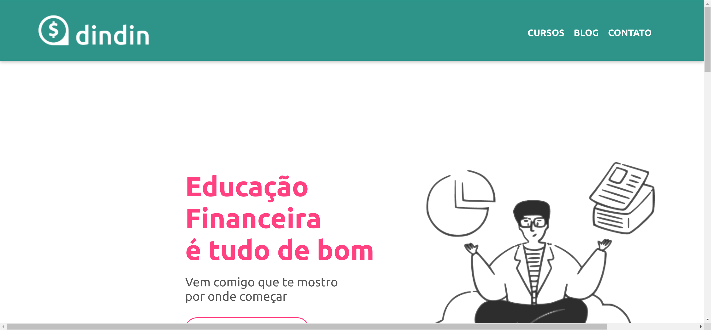
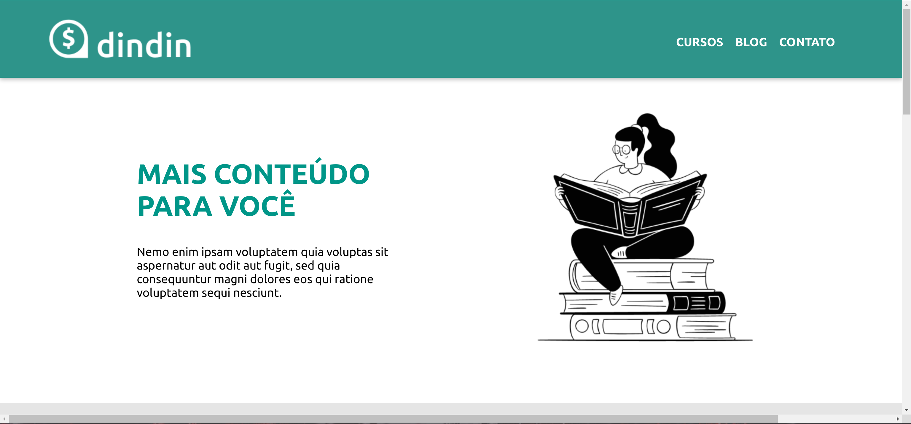

# Plataforma DINDIN

Plataforma de ensino voltada à educação financeira

Este projeto é um hands-on que foi realizado durante o curso da Gama Academy e serviu como método avaliativo.

Ainda se faz necessário realizar a parte da responsividade do site.
## COMO USAR

Para testar este projeto na sua máquina, primeiro clone este repositório:

```bash
  git clone https://github.com/keuwey/plataforma-dindin.git
```
Então faça:

```bash
  Entre no diretório do arquivo
  Clique no index.html
```
## Autor

- [@keuwey](https://www.github.com/keuwey)


## Screenshots




