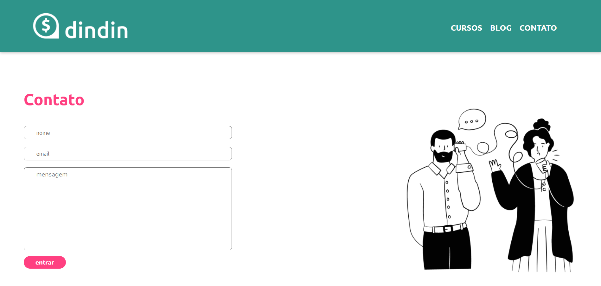

# DINDIN Platform

Teaching platform focused on financial education. This project is a hands-on that was carried out during the Gama Academy course and served as an evaluation method.

*It is still necessary to carry out the part of the responsiveness of the pages.*

## Deploy

You can access this web site [here](https://keuwey.github.io/plataforma-dindin/)

## Screenshots

## Technologies used

- HTML
- CSS
